# Pinnacle Infrastructure

**Production-grade, highly available AWS infrastructure for a UK SMB web application.**

Built with **Terraform**, this project demonstrates a cost-optimised, resilient architecture for a fictional 15-person UK digital marketing agency requiring zero-downtime deployments and enterprise-grade security — deployed entirely as Infrastructure as Code with no manual console clicks.

---

## Business Problem

A growing UK digital marketing agency needed to graduate from a single shared server to a cloud-native deployment that could:

- Survive the failure of an entire AWS Availability Zone without dropping a request
- Deploy new code multiple times per day without maintenance windows
- Keep database credentials off disk and out of source control
- Meet the operational maturity expected of an ISO-aware SMB without a full ops team

This infrastructure solves all four requirements within a budget of ~£50-60/month when running.

---

## Architecture Overview

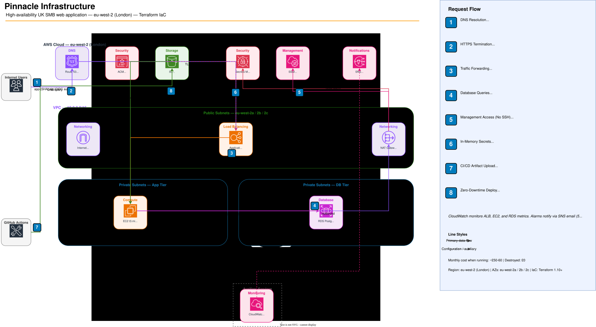

> **Edit the diagram:** Open `docs/pinnacle-aws-architecture.drawio` in [draw.io](https://app.diagrams.net).

**Region:** eu-west-2 (London) | **AZs:** eu-west-2a, eu-west-2b, eu-west-2c

---

## Module Architecture

```
pinnacle-infrastructure/
├── main.tf                    # Root orchestration (7 modules)
├── variables.tf               # Global input variables
├── outputs.tf                 # Global outputs
├── providers.tf               # AWS provider + S3 backend config
├── terraform.tfvars.example   # Variable template (safe to commit)
├── app.py                     # Flask application
│
└── modules/
    ├── networking/            # VPC, public/private subnets, NAT Gateway
    ├── security/              # Security groups, IAM role + instance profile
    ├── database/              # RDS PostgreSQL, DB subnet group, Secrets Manager
    ├── compute/               # ALB, target group, launch template, ASG, S3 bucket
    ├── dns/                   # Route 53 data source, ACM certificate, DNS validation
    ├── github-oidc/           # OIDC provider, GitHub Actions IAM role + policy
    └── monitoring/            # SNS topic, CloudWatch alarms, dashboard
```

---

## Key Design Decisions

### Single NAT Gateway
One NAT Gateway in the first public subnet instead of three (one per AZ).

- **Trade-off:** If eu-west-2a fails, private instances in eu-west-2b and eu-west-2c lose outbound internet access (SSM, Secrets Manager, S3 via public endpoint). The application *remains available* because the ALB and ASG span all AZs — only egress is impaired.
- **Saving:** ~£60/month (£30 vs £90). Acceptable for SMB portfolio, documented for interview.

### Memory-Only Credentials
Database credentials are never written to EBS or disk. The `user_data` bootstrap script writes only non-sensitive identifiers (`INSTANCE_ID`, `AWS_REGION`, `DB_SECRET_ARN`) to `/etc/app/.env`. At startup, `app.py` calls `boto3` to fetch the full credential set from Secrets Manager directly into process memory.

### OIDC for CI/CD (No Static Keys)
GitHub Actions authenticates to AWS via OpenID Connect. The IAM trust policy restricts token acceptance to a specific repository and branch (`main`) or `environment:production`. No AWS access keys are stored in GitHub Secrets.

### IMDSv2 Enforced
The launch template sets `http_tokens = "required"`, blocking SSRF attacks that abuse the Instance Metadata Service.

### Automated Certificate Validation
The DNS module creates the ACM certificate and writes the required CNAME validation records into Route 53 in the same `terraform apply`. The `aws_acm_certificate_validation` resource blocks downstream resources (ALB HTTPS listener) until the certificate is `ISSUED`.

### Zero SSH
No key pairs, no bastion hosts. All instance access is via AWS Systems Manager Session Manager (`AmazonSSMManagedInstanceCore` policy on the EC2 IAM role). Port 22 is not open on any security group.

---

## Module Details

### networking
Creates the VPC (`10.0.0.0/16`), three public subnets (`10.0.1-3.0/24`), three private subnets (`10.0.11-13.0/24`), an Internet Gateway, one NAT Gateway with an Elastic IP, and the associated route tables.

### security
Three security groups with strict least-privilege rules:

| Security Group | Inbound | Outbound |
|---|---|---|
| ALB SG | TCP 80, 443 from `0.0.0.0/0` | All |
| EC2 SG | TCP 8080 from ALB SG only | All (NAT → AWS APIs) |
| RDS SG | TCP 5432 from EC2 SG only | None |

EC2 IAM role carries `AmazonSSMManagedInstanceCore` and `CloudWatchAgentServerPolicy`. The compute module attaches a custom inline policy scoping Secrets Manager reads to the specific secret ARN and S3 reads to the deployment bucket.

### database
RDS PostgreSQL 16 on `db.t3.micro`, Multi-AZ enabled, 20 GB gp3 encrypted at rest. A `random_password` resource generates the master password — it never appears in `terraform.tfvars`. The full credential set (username, password, host, port, dbname) is stored as a JSON blob in Secrets Manager (`pinnacle/prod/db-password-<random_suffix>`).

Enhanced monitoring is enabled at 60-second granularity. Performance Insights retains 7 days of query data (free tier).

### compute
- **S3 deployment bucket** — versioning enabled, AES256 encryption, public access blocked
- **ALB** — internet-facing, spans all three public subnets, HTTP→HTTPS redirect on :80, HTTPS listener on :443 with ACM certificate
- **Target group** — HTTP :8080, health check on `/health`, deregistration delay 30 seconds
- **Launch template** — Amazon Linux 2023, `t3.micro`, IMDSv2 required, detailed monitoring enabled, `user_data` templated via `templatefile()`
- **ASG** — min 2 / desired 2 / max 4, across all three private subnets, ELB health checks, 120-second grace period, instance refresh with 50% minimum healthy percentage
- **Scaling policy** — target tracking, CPU target 60%
- **Route 53 A alias** — maps FQDN (`pinnacle.cornelcloud.net`) to ALB

### dns
References the existing `cornelcloud.net` hosted zone as a data source (does not create it). Issues an ACM certificate for `pinnacle.cornelcloud.net` using DNS validation, writes the CNAME records, and exports `certificate_arn` only after validation completes.

### github-oidc
Fetches GitHub's TLS thumbprint dynamically via `data.tls_certificate`. Creates the `token.actions.githubusercontent.com` OIDC provider (account-scoped) and an IAM role. The trust policy accepts tokens from `repo:Hyper-Git/pinnacle:ref:refs/heads/main` and `repo:...:environment:production`. The attached inline policy grants:

- `s3:PutObject` / `s3:GetObject` on the deployment bucket only
- `autoscaling:StartInstanceRefresh` on the specific ASG ARN
- `autoscaling:DescribeInstanceRefreshes`, `autoscaling:DescribeAutoScalingGroups` (no resource-level restriction — AWS limitation)
- `ec2:DescribeInstances` (no resource-level restriction)

### monitoring
Five CloudWatch alarms, all routing to a single SNS topic (`pinnacle-prod-alerts`) with an email subscription:

| Alarm | Metric | Threshold |
|---|---|---|
| EC2 CPU High | `CPUUtilization` (ASG avg) | > 80% for 10 min |
| ALB 5xx Errors | `HTTPCode_Target_5XX_Count` | > 10 per minute for 2 min |
| ALB Response Time | `TargetResponseTime` | > 2 seconds for 10 min |
| RDS CPU High | `CPUUtilization` | > 80% for 10 min |
| RDS Storage Low | `FreeStorageSpace` | < 2 GB |

CloudWatch Dashboard with six widgets: ALB request count, ALB response time, EC2 CPU (ASG), RDS CPU, RDS connections, RDS freeable memory.

---

## CI/CD Pipeline

`.github/workflows/deploy.yml` triggers on every push to `main`.

### Test Job
```
Checkout → Setup Python 3.11 → pip install → verify all imports load
```

### Deploy Job (runs only if test passes)
```
OIDC auth → package app.zip (excludes .git, .terraform, *.tfvars, .env)
  → upload to s3://pinnacle-deployments-cornelcloud/releases/app-{SHA}.zip
  → update s3://.../releases/app-latest.zip
  → StartInstanceRefresh (50% min healthy, 120s warmup)
  → poll DescribeInstanceRefreshes every 30 seconds (20 min timeout)
  → exit 0 on Successful, exit 1 on Failed/Cancelled/Timeout
```

Instance Refresh replaces instances one-by-one. The ALB continues routing to healthy old-version instances while new instances warm up, achieving zero-downtime deployment.

---

## Application

`app.py` is a Python Flask application with three routes:

| Route | Description |
|---|---|
| `GET /` | Returns instance ID and secret source (confirms which instance served the request) |
| `GET /health` | ALB health check — returns `{"status": "healthy", "instance_id": "...", "timestamp": "..."}` |
| `GET /db-check` | Live PostgreSQL connectivity test — returns connection status and host |

On startup, if `DB_SECRET_ARN` is set, the app calls `boto3` to fetch credentials from Secrets Manager and overwrites the `DB_CONFIG` dict in memory. No credentials are written to disk.

If the S3 deployment artifact is absent on first boot (fresh ASG), `user_data` writes a minimal bootstrap `app.py` so the instance passes health checks immediately, avoiding a failed launch.

---

## Getting Started

### Prerequisites

- Terraform >= 1.10
- AWS CLI configured with permissions to create VPC, EC2, RDS, IAM, Route 53, ACM, S3, CloudWatch resources
- An existing Route 53 public hosted zone (the DNS module uses it as a data source)
- S3 bucket `cornel-tf-state` in `eu-west-2` for remote state (or update `providers.tf` with your own)

### Deployment

```bash
# 1. Clone the repository
git clone https://github.com/Hyper-Git/pinnacle.git
cd pinnacle

# 2. Configure variables
cp terraform.tfvars.example terraform.tfvars
# Edit terraform.tfvars with your domain, email, and GitHub repo

# 3. Initialise backend and providers
terraform init

# 4. Preview changes
terraform plan

# 5. Deploy (expect ~15 minutes — RDS Multi-AZ is the bottleneck)
terraform apply
```

### Targeted Deployment (Development)

```bash
# Deploy only the networking layer
terraform apply -target=module.networking

# Deploy only the database (useful to test RDS before full apply)
terraform apply -target=module.database

# Validate syntax without connecting to AWS
terraform validate

# Format all .tf files
terraform fmt -recursive
```

### Tear Down (Cost Control)

```bash
terraform destroy
```

State persists in S3 — re-running `terraform apply` recreates the full infrastructure from the stored state.

### Required Variables (`terraform.tfvars`)

| Variable | Description | Example |
|---|---|---|
| `domain_name` | Root domain of existing Route 53 hosted zone | `"cornelcloud.net"` |
| `subdomain` | Subdomain for the app | `"pinnacle"` |
| `db_username` | RDS master username | `"pinnacle_admin"` |
| `alert_email` | SNS notification recipient | `"ops@example.com"` |
| `github_repo` | GitHub repo for OIDC trust | `"Hyper-Git/pinnacle"` |
| `deployment_bucket_name` | S3 bucket for app artifacts | `"pinnacle-deployments-cornelcloud"` |

> **Never commit `terraform.tfvars`** — it is in `.gitignore`. The RDS password is generated automatically by `random_password` and stored only in Secrets Manager.

---

## Portfolio Evidence

This section provides visual evidence of each infrastructure phase, demonstrating the build process from networking foundation through to automated CI/CD deployments.

---

### Phase 1: Networking Foundation

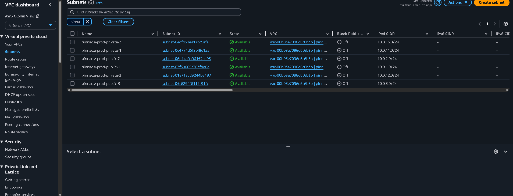
*VPC `10.0.0.0/16` with 3 public and 3 private subnets spread across eu-west-2a / 2b / 2c, proving multi-AZ network isolation.*

---

### Phase 2: Security & IAM

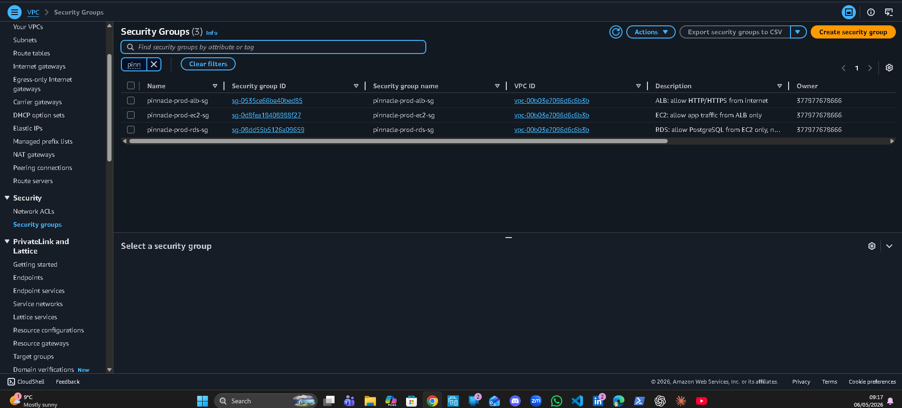
*Three security groups enforcing least-privilege rules: ALB accepts public HTTPS, EC2 accepts port 8080 from ALB only, RDS accepts port 5432 from EC2 only.*

---

### Phase 3: Database Layer

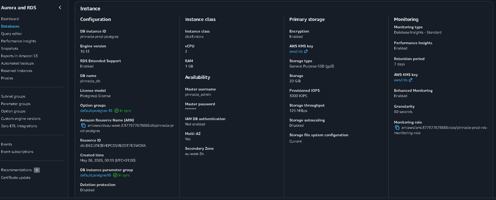
*RDS PostgreSQL 16 in Multi-AZ mode — primary in one AZ with a synchronous standby in a second, proving automatic failover capability.*

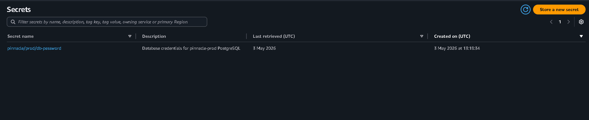
*Database credentials stored as a JSON blob in Secrets Manager (`pinnacle/prod/db-password-*`) — value hidden, proving no credentials live in source control or on disk.*

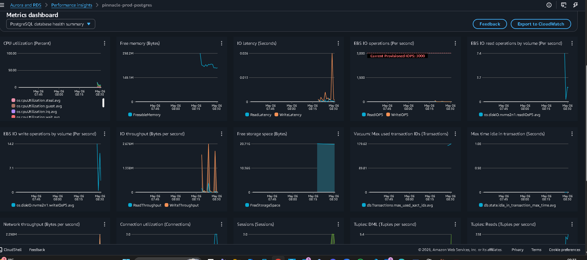
*RDS Performance Insights dashboard showing query-level metrics, proving observability is enabled at the database layer.*

---

### Phase 4: Compute & Load Balancing


*ALB configured with two listeners: HTTP :80 permanently redirects to HTTPS, and HTTPS :443 forwards to the target group using the ACM certificate.*


*All EC2 instances registered in the target group showing "healthy" status, confirming the `/health` endpoint is responding and the ASG is operational.*

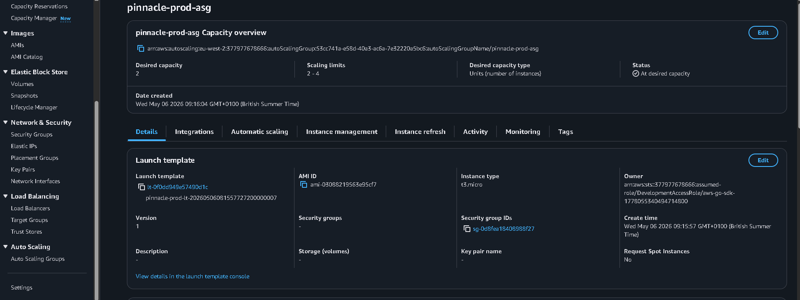
*Auto Scaling Group showing min:2 / desired:2 / max:4 configuration across all three private subnets, proving high-availability compute placement.*


*Live application served over HTTPS at `pinnacle.cornelcloud.net` with a valid ACM certificate, proving end-to-end TLS termination on the ALB.*

---

### Phase 5: Monitoring & Alerting

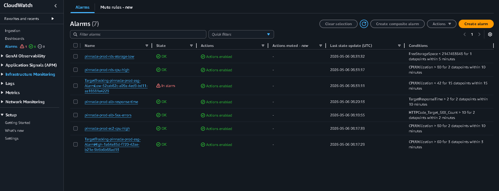
*Five CloudWatch alarms covering EC2 CPU, ALB 5xx errors, ALB response time, RDS CPU, and RDS storage — all wired to the SNS topic.*

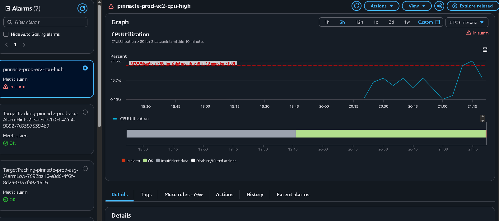
*EC2 CPU alarm in ALARM state after a deliberate stress test, proving the alert chain fires correctly under load.*

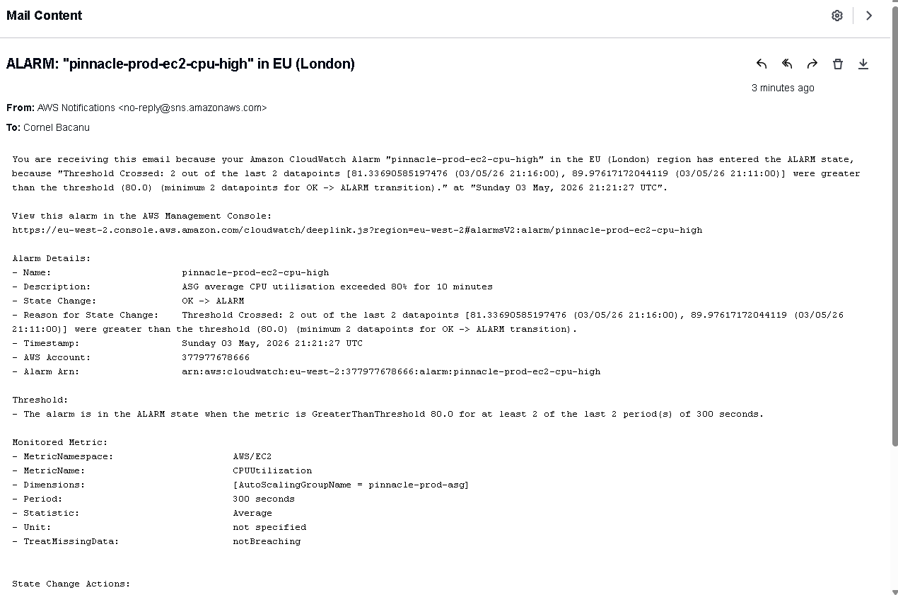
*SNS email notification received in inbox when the CPU alarm triggered, proving the end-to-end alerting pipeline works.*


*CloudWatch dashboard showing live ALB request count, EC2 CPU utilisation, RDS connections, and freeable memory — captured during a load test.*

---

### Phase 6: CI/CD Pipeline

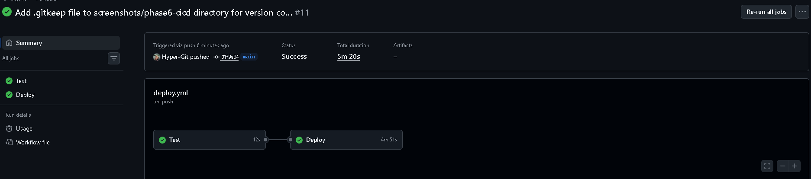
*Completed GitHub Actions run showing both the Test and Deploy jobs green, proving the full CI/CD pipeline executes end-to-end on push to main.*

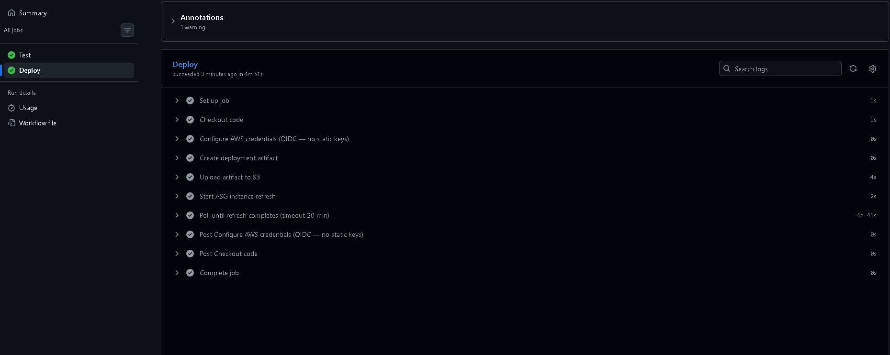
*Deploy job step detail: OIDC authentication, S3 artifact upload, and Instance Refresh polling — proving zero static AWS credentials are used.*

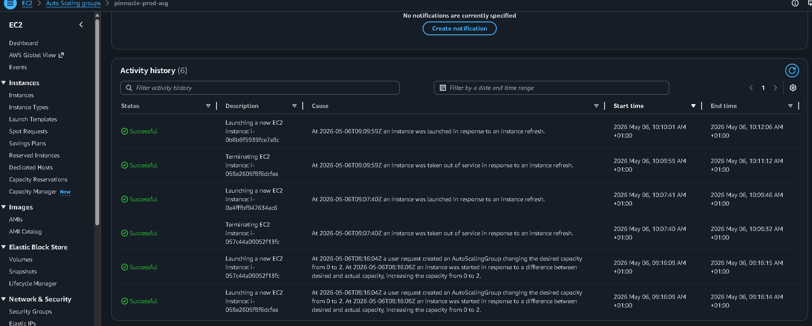
*ASG Instance Refresh activity log showing "Successful" status, proving instances were replaced one-by-one with zero downtime during deployment.*

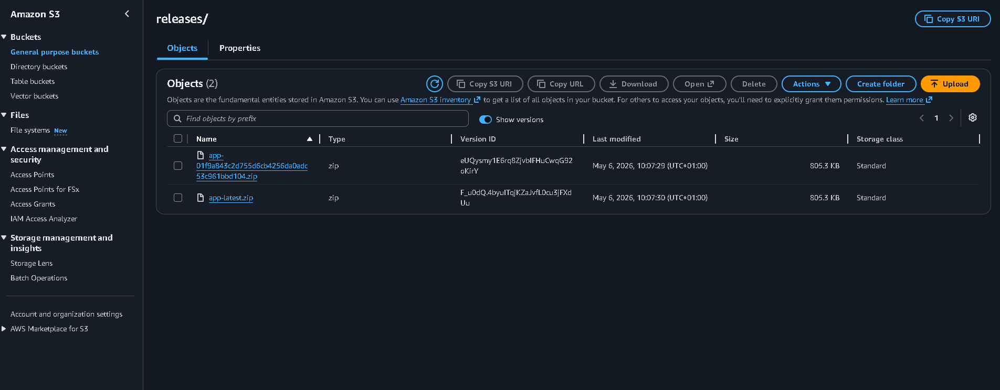
*S3 deployment bucket showing versioned `app-{SHA}.zip` artifacts from multiple pipeline runs, proving the immutable artifact trail.*

---

## Cost Breakdown

All prices approximate, eu-west-2 (London), on-demand.

| Resource | Monthly Cost |
|---|---|
| RDS PostgreSQL 16 Multi-AZ db.t3.micro | ~£28 |
| NAT Gateway (hourly + data transfer) | ~£15–30 |
| ALB (hourly + LCU) | ~£15 |
| 2× EC2 t3.micro (ASG baseline) | ~£12 |
| S3, CloudWatch, Secrets Manager | < £5 |
| **Total (running 24/7)** | **~£50–60/month** |
| **Destroyed** | **£0** |

The NAT Gateway is the highest variable cost. VPC endpoints for S3, SSM, and Secrets Manager could eliminate it entirely for ~£10/month in endpoint charges — a worthwhile swap for a long-running environment.

---

## Scaling Path

This architecture is designed to scale with the business without a rewrite:

1. **Read replicas** — Add `aws_db_instance` with `replicate_source_db` to offload reporting queries
2. **ElastiCache** — Add a Redis cluster in the private subnets for session storage and query caching
3. **Aurora PostgreSQL** — Swap RDS for Aurora to get serverless v2 autoscaling and up to 15 read replicas
4. **Multi-region** — The modular structure allows deploying to a second region with a different `var.aws_region`; add Route 53 latency-based routing
5. **ECS/Fargate** — Replace the ASG launch template with an ECS task definition for container-native deployments
6. **WAF** — Attach AWS WAF to the ALB for OWASP rule group protection

---

## Security Posture

| Control | Implementation |
|---|---|
| No public IPs on app tier | EC2 instances in private subnets only |
| No SSH access | No key pair; SSM Session Manager via IAM role |
| No static credentials in CI/CD | GitHub OIDC with repository and branch-scoped trust |
| No disk credentials | `boto3` fetches Secrets Manager into process memory only |
| IMDSv2 enforced | `http_tokens = "required"` in launch template |
| RDS isolated | Security group ingress restricted to EC2 SG on port 5432 only |
| Encryption at rest | RDS `storage_encrypted = true`, S3 AES256 |
| Least-privilege IAM | Resource-specific ARNs for Secrets Manager and S3; no wildcard permissions on EC2 role |
| Audit trail | CloudTrail captures `GetSecretValue` calls; NAT Gateway is single egress point for flow log auditing |

---

## State Backend

```hcl
backend "s3" {
  bucket       = "cornel-tf-state"
  key          = "pinnacle/prod/terraform.tfstate"
  region       = "eu-west-2"
  use_lockfile = true   # Terraform 1.10+ native locking (no DynamoDB required)
}
```

---

## Author

Built by **Cornel Bacanu** as part of the Pinnacle Cloud Portfolio.

- **Live URL:** `pinnacle.cornelcloud.net`
- **Portfolio:** `cornelcloud.net`
